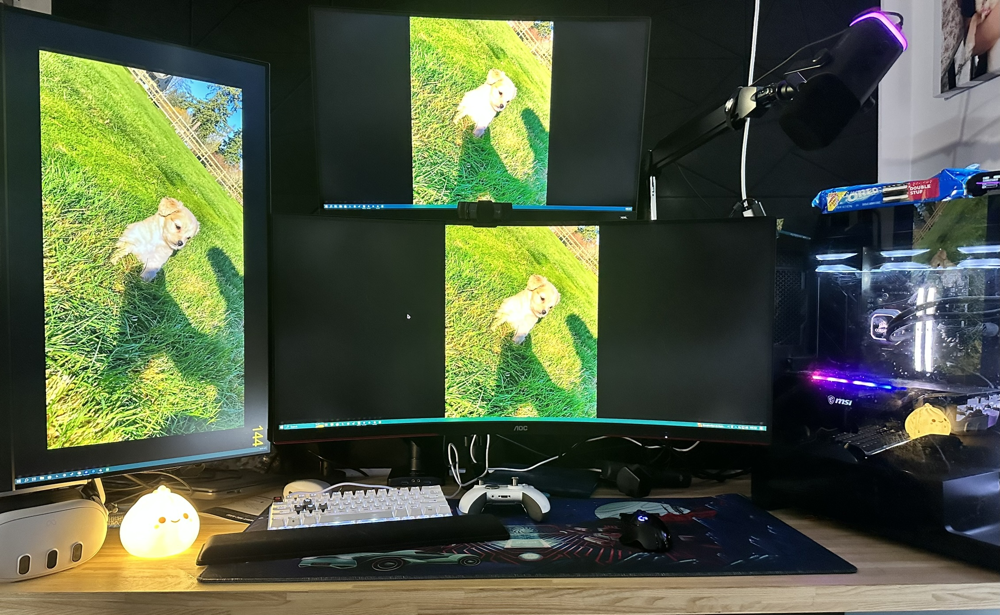

# **Hobbies**
My favorite activities

## Video Games
I almost always play video games 3x a week and has been one of my biggest hobbies for 15 years. I love to play multiplayer games and really, it’s to connect with friends. Games can range from FPS to MMOs, but surprisingly I don’t enjoy Single player games.
### Why i enjoy video games:
1. Honestly the best way to connect with friends that have moved away from home
2. Has made me want to improve my computer which in turn has made me learn more about hardware and software
3. I get good laughs with my buddies

*Disclaimer: claimed to be good with hardware not hiding cables*

## Paddle Boarding (summer)
I always go camping during the summer, typically it’ll be my fiancé, my two dogs, and I. We either go to Lake Chelan or Deception Pass. Luna (Golden) loves the water and Alani (Husky) **Absolutely Hates** the water, but when we camp, we also go hiking. We like to go camping to areas with water because we always paddle board, it’s been a tradition for us since before we started dating in high school.

### Why I enjoy paddle boarding:
1. I have always enjoyed any activity in the water
2. Its very relaxing, and half the time I sneak in a little nap 
3. My golden loves it and there is nothing like watching your older dog run and jump around like a puppy
   *Both dogs are mini sized*

